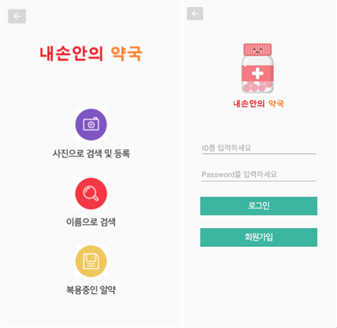

## 💊 알약인식 애플리케이션

## 🛠️ 개발환경
- Android Studio
- PYTORCH
- MySql
- Apache
- phpMyAdmin
- Ubuntu

## 💻 메인 화면

## 💡 주요 기능
- 인식(Yolo, EAST, CRNN, Seq2Seq를 활용하여 다양한 방면에서 학습시켜 인식률을 높임)
- 검색(사진 또는 이름으로 약에대한 정보를 검색 가능)
- 알람(복용하는 약, 시간을 설정해 알림가능)
- 

   
## 📊 Sequence Diagram

